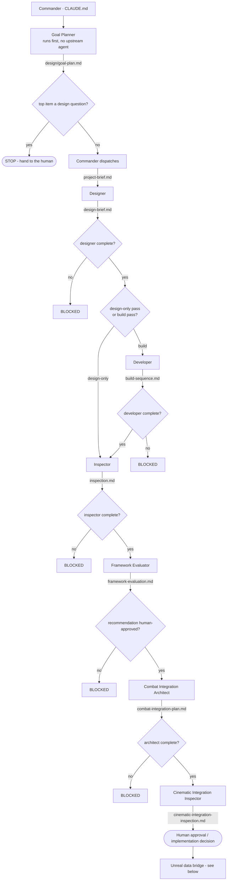
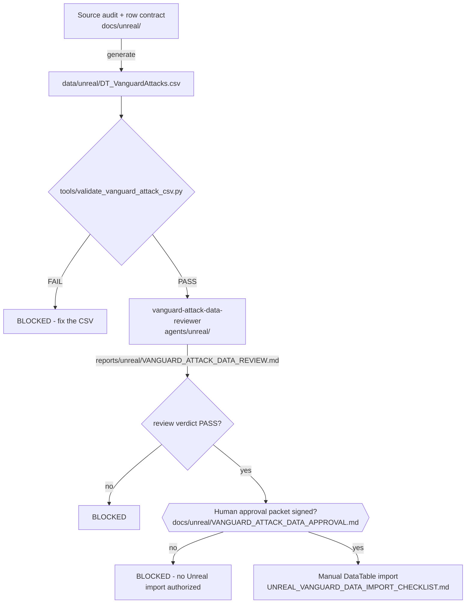

# CLAUDE.md — Commander's brief (canonical)

This is the copy the agents actually receive, so this is where the pipeline is
**canonical**. `README.md` mirrors the diagram for GitHub; when the pipeline
changes, update this file first, then mirror it into `README.md`.

## The game
**Ascendant Impact** — a cinematic **one-versus-one** cyber-fantasy martial-arts
action fighter in **Unreal Engine 5.8** on **PC**, third person. The player picks
**Agent Echo** (6 ft 0, precision striker) or **Agent Nova** (5 ft 8, pressure
striker) and enters the industrial arena **Shattered Ring** to duel **Crimson
Vanguard** (Project Valor-7, 6 ft 10, heavily armored). A duel runs **three to five
minutes**. Both fighters share **ONE** combat framework and differ only in
animation, stance, VFX flavor, and timing feel.

Source of truth is the GDD (`Ascendant_Impact_Assignment_02_Revised_GDD_Anthony.pdf`,
v0.4), distilled into `project-brief.md`, which is the single input the designer
consumes. **Central promise:** real-time martial-arts combat rewards player skill
with brief, earned anime-style cinematic spectacle.

**Core loop:** read the rival's telegraph → attack, dodge, or counter → build
Ascension energy → hit a timing input → adapt in Phase 2 → attempt the Final Clash.

## Assignments, deadlines, and rubric mapping
Course: **Multi-Agent AI for Game Development**. The requirement docs are on disk in
[`assignments/`](assignments/) and are the source of truth — read them before
claiming any criterion is met.

| # | Deliverable | Due (11:59 ET) | State |
|---|---|---|---|
| **#02** | Final GDD | **23 July 2026** | **DELIVERED** — GDD v0.4 on disk |
| **#03** | Build an Agent Crew | **28 July 2026** | **DELIVERED** — all six agents ran to completion; six artifacts + six leave-offs on disk |
| **#04** | Dynamic Content Pipeline | **30 July 2026** | **DELIVERED** — two independent submissions in `assignment-04/`, merged to `main` |
| **#05** | Goal-Oriented Coding Agent | — | **DELIVERED** — `assignment-05/`: the `goal-planner` agent, the arena pipeline, the gap scanner |
| **#06** | Generate–Evaluate–Refine pipeline | **18 August 2026** | **DELIVERED** — `assignment-06/`, built 12 August |
| **#07** | Style Guide Agent | **20 August 2026** | **DELIVERED** — `assignment-07/`, graded with a real model |

**Every coursework deadline so far has passed and every one was met.** The live date is
the **1 September 2026** ship date. On session start, report today's date and **the days
remaining to 1 September**, and report the assignments above as delivered.

**⚠ Open question the repo cannot answer.** This branch is named `assignment-10/final-game`
and the session is named for A10, but **`assignments/` holds requirement docs only for
#02, #03 and #04** — there is nothing on disk for #08, #09 or #10. Treat 1 September as
the ship date it has always been, and **ask the user for the #10 requirement doc rather
than inferring what it wants.** Do not assume the final submission is only the build.

### The game ships 1 September 2026 — two phases
Separate from the assignment deadlines above, **the playable game is due 1 September
2026.** This is a **constraint on design complexity**: anything that cannot be built
and tuned in the remaining days is out of scope, however good it is. Where two
approaches both satisfy the GDD, take the one that ships.

| Phase | Window | Deliverable | Milestones |
|---|---|---|---|
| **Phase 1 — basic version** | now → **1 Sept 2026** | a duel that can actually be **fought start to finish**, with **some design on it** — not a bare gray-box tech demo | M1 → M4, then a thin presentation floor |
| **Phase 2 — polish** | after Phase 1 is playable | as polished and good-looking as possible — graphics, VFX, camera, sound, arena reaction | full **M5** |

**How Phase 1 gets a look without breaking milestone order.** M5 stays gated behind a
stable M4. Phase 1 earns its visual identity by **dressing the proxies** instead:
M1–M4 may stand up **free** third-party meshes, animations, and set dressing from the
start (Unreal starter/template content, the **Fab** free tier, free Quixel grants,
**Mixamo**). Picking a proxy asset is asset selection, not a presentation pass. What
remains M5 is the *tuned* work — hit-stop feel, camera choreography, VFX authoring,
sound design, arena impact reaction, final character treatment.

**Assets should cost $0**, must be licensed for a submitted course build, and still
pass the human approval and rights-review gate. Where no free asset exists, the gap
gets named and a free fallback proposed — never assume a purchase.

**When the calendar and the wish list disagree, a complete fought duel on 1 September
beats a beautiful incomplete one.**

### SHIP SCOPE — cut on 2026-08-23, and this is what "the game" now means

**The plan is [`SHIP-PLAN.md`](SHIP-PLAN.md). Read it before dispatching anything.** It
carries the day-by-day calendar, the task list T1–T8 / S1–S6 / P1–P2, and the risks. The
four decisions behind it are **D1–D4**, recorded permanently in
[`design/decisions.md`](design/decisions.md) and made by the designer of record on
2026-08-23.

| | Decision | What it means for dispatch |
|---|---|---|
| **D1** | **Health zero wins the duel.** The **Ascension Meter, Impact Windows and the Final Clash are deferred future scope.** | **Amends Q22**, which is on the record as *settled and binding*. `MinHealthFloor` stays **0**; C1, C2 and C3 are released; item 64 is closed by deferral. **This supersedes a GDD line — rule 4 has fired.** See item 75 in `TODO.md`. |
| **D2** | **Three Vanguard attacks.** Phase 2 optional, only if the calendar allows. | Scopes `game/AGENTS.md`'s *"only Attack A is enabled"* to the paused DataTable route. The graybox driver may carry three. **Within the scope lock** (four permitted). Every value stays provisional. |
| **D3** | **Material-instance recolor** is the character look. A free Fab/Mixamo swap is optional and last. | Arena materials and lighting proceed now as asset dressing. |
| **D4** | **The `DT_VanguardAttacks` DataTable route stays paused permanently** for this ship. | Anthony's signed approval packet and the missing countersignature are **moot** — that road is not being taken. **V1–V5 stop being a ship blocker**: they correct a cinematic restore that no longer exists. |

**Everything deferred is deferred whole.** It is not partially built, and **no agent may
resume a piece of it without a new recorded decision in `design/decisions.md`.** An agent
that builds a meter, an Impact Window, or a Final Clash has exceeded ship scope exactly as
surely as one that builds a second arena.

**The old plan is not deleted, and that is deliberate.** `design-brief.md`,
`combat-integration-plan.md`, `build-sequence.md` and most of `TODO.md` still describe the
full GDD game, including everything D1 deferred. They are **correct documents about a
larger game than the one shipping on 1 September.** Read them as reference. When one of
them disagrees with `SHIP-PLAN.md` about what to build in the next nine days,
**`SHIP-PLAN.md` wins** — and when either disagrees with the GDD about what the *game is*,
the GDD still wins, because deferring a feature is not the same as redesigning it.

### #03 — Build an Agent Crew (/10)
| Criterion | Pts | Where it is satisfied |
|---|---|---|
| Working Crew | 3.0 | **SATISFIED.** Six agents ran to completion without crashing, producing `design-brief.md` → `build-sequence.md` → `inspection.md` → `framework-evaluation.md` → `combat-integration-plan.md` → `cinematic-integration-inspection.md`, each handoff recorded in `leave-offs/` |
| Game Connection | 3.0 | `README.md` names **Ascendant Impact** and explains what the crew produces for it |
| Role Clarity | 2.0 | the crew table in this file + `README.md`; each agent has one input, one output, and no agent is removable |
| Architecture Diagram | 1.0 | the mermaid diagram, mirrored in this file and `README.md` |
| ReadMe | 1.0 | `README.md` |

**Working Crew is closed.** The final chain verdict is **APPROVED WITH REQUIRED
CHANGES**: the sandbox test and M1–M2 may proceed on the approved Blueprint-first
foundation, while **M3 sign-off waits on the designer accepting five named
corrections (V1–V5) to the cinematic restore contract** in
`cinematic-integration-inspection.md`.

**As of 2026-08-23 (D1/D4) V1–V5 are no longer a blocker on anything.** They correct a
cinematic restore contract, and the cinematic restore is deferred future scope. They stay
APPROVED and unapplied, which is the correct resting state for deferred work — **not an
outstanding task, and not to be raised again as one.** The assignment grade is unaffected:
the crew ran, the artifacts exist, and the verdict is what it is.

### #04 — Dynamic Content Pipeline (/10)
A **separate** deliverable from the crew above. It reads the game docs before
generating, so output sounds like Ascendant Impact rather than generic content.
Needs: the pipeline itself, **three generated outputs the game actually needs**, and
a ReadMe covering what was generated, whether it sounds like the game, and what the
critic agent caught.

| Criterion | Pts | What it demands |
|---|---|---|
| Game-Anchored Source | 2.0 | knowledge base **is the GDD lore doc** or a direct extension — placeholder lore scores 0 here *and* on Content Fit |
| Content Fit | 2.5 | three content types **this game specifically needs**; must name the gap ("my game is thin on X") and fill it |
| RAG Implementation | 2.0 | show **query, retrieved chunk, and output side by side** |
| Consistency Checking | 2.0 | a **critic agent** catches and corrects ≥1 lore break or tone drift — the correction is **shown, not claimed** |
| Voice Judgment | 1.5 | self-assessment plus ≥1 concrete prompt or retrieval tweak made to improve game-fit |

**Code that does not run scores 0 across all criteria.** Functional code is the
minimum bar, not an achievement.

**What was actually built and submitted — `assignment-04/`.** Two independent
submissions share one knowledge base. Both are merged to `main` and both are
**finished coursework — do not regenerate, reorganize, or "improve" them.**

| Path | Whose | The three content types generated |
|---|---|---|
| `assignment-04/tony/` | Anthony | Vanguard telegraph pack · Impact Window beat pack · Shattered Ring reaction pack (player-facing) |
| `assignment-04/madion/` | **This repo's owner** | Animation integration briefs · VFX + audio cue sheets · QA edge-case test pack (implementation-support) |
| `assignment-04/shared/` | both | `knowledge-base/` (`core-canon.md`, `vanguard-telegraphs.md`, `impact-window-cinematics.md`, `shattered-ring-reactions.md`, `retrieval-manifest.md`) + `critic-rules/consistency-checklist.md` — the seven rules |

The knowledge base is the extracted GDD plus its own downstream artifacts, so
Game-Anchored Source is satisfied by construction. The pipeline is real Python with
tests: `py -3 -m unittest assignment-04/tony/pipeline/test_pipeline.py` → **175 pass.**

**Gaps that are still open** (named by the GDD, not filled by #04, and therefore
still fair game if more content is ever needed): Shattered Ring has no history;
Project Valor-7 has no origin; "Ascendant operative" and the Ascension fiction are
undefined; the **shorter in-combat UI label** for Crimson Vanguard is unfinalized.

**The four attack working names now exist but are NOT canon.** `Fault Line` (A),
`Advance Line` (B), `Bulwark Reach` (C), `Thruster Snap` (D) were generated by #04
and carried into `data/unreal/DT_VanguardAttacks.csv`. Every file that uses them
labels them *proposed, pending designer review, not an established GDD fact*. Keep
that labeling. Only the user may promote them to canon.

### This does NOT conflict with the no-runtime-AI constraint
Assignment #04 is **offline authoring tooling**, not shipped game code. The brief
already permits exactly this: generative tools for ideation, reference,
documentation, and offline drafts, with nothing entering the build without human
review and explicit designer approval. The #04 pipeline and its critic agent live
**outside** the game's SCOPE LOCK, which governs game features, not tooling. Crimson
Vanguard remains deterministic authored logic and the shipped build still makes no
runtime model calls.

### The GDD — on disk, and it is the source of truth
**`Ascendant_Impact_Assignment_02_Revised_GDD_Anthony.pdf`** — Assignment #02
Revised, **v0.4, 2026-07-24**, 17 pages — is the **source of truth** for this game.
`project-brief.md` is a distillation of it and defers to it on any conflict.

`Ascendant_Impact_GDD_Assignment_01_Anthony.pdf` is the earlier draft and is
**superseded** — do not cite it. Its major reversal: Nova was an authored rival in
v0.1 and is a **selectable player avatar** in v0.4.

**The PDF's pages cannot be rendered by the Read tool on this machine** —
`pdftoppm`/poppler is absent. `pypdf` is installed and works, and as of **2026-08-02**
the GDD is fully recovered into **`gdd/`**. Start at **`gdd/INDEX.md`**.

| Path | What it is |
|---|---|
| **`gdd/sections/`** | The authored text, **one file per numbered section 01–10** plus front matter, so a citation can be narrower than a page. Text verbatim; only the repeating page header was removed. **Cite this for authored text.** |
| **`gdd/reference/`** | **Recovers pages 10–14** — the five supplied image reference sheets. **Cite this for anything visual.** |
| `gdd/ascendant-impact-gdd-v0.4.md` | The original page-1-to-17 dump. Kept because `entry_gate.py` requires it and existing artifacts cite it. **Superseded for new work.** |

**Pages 10–14 are no longer a blind spot.** They are image sheets — character scale,
arena, Echo, Nova, Crimson Vanguard — with no extractable text, so each page's embedded
JPEG was pulled from the PDF's `/XObject` resources with `pypdf` and read directly.
Every file in `gdd/reference/` states at the top that it **describes an image rather
than quoting authored text**, quotes labels printed inside the art exactly, and marks
everything unclear as **AMBIGUOUS**. **Authored text outranks any image description, and
no agent may guess at anything marked ambiguous.**

`gdd/reference/OPEN-QUESTION-IMPACT.md` records what the sheets say about
`design-brief.md` §14 — including the one value they recover (**Crimson Vanguard is
208 cm**, a blank in §13.1 row 28), what they only inform, and two possible
contradictions raised for the designer. It resolves nothing on its own authority.

Re-extract everything with `pypdf` if the PDF is ever revised — sections, page images,
and the sheet descriptions.

`entry_gate.py` now requires **all three** — `project-brief.md`, the GDD PDF, and the
extracted markdown — before the **designer** may spawn, so an unanchored crew run is
structurally impossible.

### Two capstones, two separate submissions
Ascendant Impact and Capstone Werewolf are **separate graded submissions** for
different classes. This project needs **its own** run crew and **its own** #04
pipeline — never reuse, copy, or cite the werewolf project's `design-brief.md`,
`build-sequence.md`, or generated content as output for this one. The werewolf repo
is a **structural template only**; every artifact here must be about Ascendant
Impact. A crew output that mentions mansions, scent, or werewolves is a defect.

## SCOPE LOCK — do not exceed it
One player, one authored AI opponent, one arena, one shared player-combat
framework, **four** authored rival attacks (A–D), one complete duel with a win and
a loss outcome. Everything else — unique per-fighter move sets, more fighters, more
arenas, more attacks, a second rival move set, multiplayer, progression, story — is
**deferred future scope**. Temper every specialist against this wall. A specialist
that designs or builds a deferred feature has failed the task, not exceeded it.

**The 2026-08-23 ship scope sits INSIDE this lock and is narrower still.** D1 additionally
defers the Ascension Meter, Impact Windows and the Final Clash; D2 ships **three** of the
four permitted rival attacks. Nothing about D1–D4 widens the lock — they only take less of
what it already allowed. **Both walls apply.** A feature must clear the scope lock *and*
be in ship scope before anyone builds it.

## HARD CONSTRAINT — no runtime AI-model calls
The shipped game makes **NO runtime AI-model calls.** Crimson Vanguard is
**deterministic authored logic** — a state machine or Behavior Tree. Generative
tools may help with ideation, reference, documentation, and offline drafts **only**.
Nothing generated enters the build without human review and **explicit approval
from the designer**, who owns all rules and numbers. **Treat every timing value as
provisional and pending playtest.** No agent may change a number, and no agent may
resolve a provisional value on its own authority — it surfaces the question instead.

## Build order — milestones, in this order
| # | Milestone | Meaning |
|---|---|---|
| **M1** | Combat gray box | shared player framework, playable, untextured |
| **M2** | Rival state loop | six-state rival cycling its four attacks |
| **M3** | Impact handoff | ~~Impact Windows, meter, counter / perfect-dodge scoring~~ — **DEFERRED WHOLE by D1.** What replaces it in ship scope: the player's dodge with i-frames (**T3**) |
| **M4** | Complete duel | **REDEFINED by D1** — win and loss outcomes by health zero, plus restart. ~~Final Clash incl. failure~~ deferred; Phase 2 optional (**T7**) |
| **M5** | Presentation pass | the **tuned** work only — hit-stop, camera choreography, VFX, sound (**S5**). **Still correctly locked behind a stable M4.** Arena, lighting, materials and recolor are asset dressing and run earlier (**S1–S4**) |

**M1–M4 are Phase 1** (playable by 1 Sept, dressed with free proxy assets). **M5 is
Phase 2.**

**⚠ The milestone numbers above describe the PLANNED architecture. The prototype took a
different, working route, and the route it took is the one that ships.** Read the table as
the ordering principle it is — gray box before rival loop before complete duel before
polish — not as a list of assets to create.

### Current state as of 2026-08-23 — THE GAME EXISTS AND RUNS

**The Unreal project is in this repository at [`game/`](game/)** — added as a subtree on
2026-08-23, with Git LFS carrying the binary assets. `game/AscendantImpact.uproject`,
UE 5.8, **Blueprint-only, no `Source/`**. Everything below has been built and validated in
PIE across **fifteen milestones**. The authoritative running record is
**[`game/docs/agent/PROTOTYPE_BLACKBOARD.md`](game/docs/agent/PROTOTYPE_BLACKBOARD.md)**,
and `game/CLAUDE.md` is the operating guide for working inside the editor — including a
long, hard-won list of Unreal MCP gotchas that will save hours. **Read both before any
in-engine work.**

**Working today:** player movement, jump-over with dynamic side switching, punch, health,
hit-react, camera shake, ragdoll death · a Vanguard with range-band AI movement,
directional locomotion, and **one** telegraphed strike that is interruptible before impact
and honestly dodgeable in depth · a 2.5D duel camera rig with mutual facing and arena
bounds ±650 · a duel HUD with both health bars · a knockout coordinator that drops either
fighter at zero health · and a full **octagon arena blockout** (`Lvl_ArenaOctagon`,
two-tier gallery, truss walls) generated by the scripts in `game/Tools/ArenaPipeline/`.

**The two gaps that matter, and they are systems, not tuning:**

1. **The player wins nearly every time.** Punch costs nothing and there is no dodge, block
   or counter — mashing ends the fight. Fixed by **T2** and **T3** in `SHIP-PLAN.md`.
2. **The Vanguard repeats one move forever.** No variety, no phase change, no punish.
   Fixed by **T4** and **T5**.

**Also missing:** win/loss resolution (at zero health a body drops and *nothing happens*),
restart, round timer. Everything is gray prototype material, the duel still runs in the
flat test box, the project default map is still the stock template level, and **the
project has never once been packaged.**

**Proxy cast, as actually built** — note this is the reverse of what earlier drafts of this
file said: the **player** is `BP_ThirdPersonCharacter` on the **Quinn** mesh; **Crimson
Vanguard** is `BP_VanguardProxy` on the **Manny** mesh at 1.1 uniform scale. Nova is not
built and is out of ship scope.

**On session start, report which milestone we are on** based on what is in
`leave-offs/` and on disk. No step may depend on a later milestone, and **M5 work
must never be interleaved into M1–M4.**

## Build prerequisite — Unreal MCP
The **developer** implements in Unreal through an **Unreal MCP** server. It must be
connected *before the developer runs*. The **designer** should therefore produce a brief
concrete enough to drive Blueprint work through that MCP (real editor paths and Blueprint
node names, gray-box first).

**The concrete wiring, established 2026-08-04.** The server is Epic's own
**`ModelContextProtocol`** plugin — *"Anthropic MCP server implementation for Unreal
Engine"*, **Experimental**, shipped in the engine at
`Engine/Plugins/Experimental/ModelContextProtocol`. It is **not** a third-party bridge.

| | |
|---|---|
| Transport | **HTTP**, `http://127.0.0.1:8000/mcp` |
| Settings | **Project Settings → Plugins → Model Context Protocol** (`UModelContextProtocolSettings`, saved to `EditorPerProjectUserSettings`) |
| Defaults | `ServerPortNumber = 8000` · `ServerUrlPath = /mcp` · **`bAutoStartServer = false`** · `bEnableToolSearch = true` |
| Client config | `.mcp.json` at the **repo root**, server name **`unreal-mcp`** |
| Console commands | `ModelContextProtocol.StartServer [port]` · `.StopServer` · `.RefreshTools` · `.GenerateClientConfig <ClaudeCode\|Cursor\|VSCode\|Gemini\|Codex\|All>` |

**Two traps.**

1. **`bAutoStartServer` defaults to `false`.** Enabling the plugin and ticking toolsets is
   **not** enough — nothing listens on 8000 until the server is started. Verify with
   `netstat -ano | findstr 8000`, never by assumption.
2. **Tool search is on**, so `tools/list` returns only three meta-tools —
   `list_toolsets`, `describe_toolset`, `call_tool`. Every real editor tool is reached
   **through `call_tool`**. That is why the developer's allowlist names exactly those three
   and not a long list of editor verbs.

`ModelContextProtocol.GenerateClientConfig ClaudeCode` writes `.mcp.json` relative to the
**Unreal project** directory. **As of 2026-08-23 that directory is [`game/`](game/)**, not
the `FightGame/` this file used to name — and both `.mcp.json` files now exist, at the repo
root and at `game/.mcp.json`, pointing at the same `http://127.0.0.1:8000/mcp`. **Check
the path if you use the console command**; the committed `.mcp.json` at the repo root is
the one that counts for Claude Code.

**A third trap, learned the hard way and recorded in `game/CLAUDE.md`: the PIE world
advances in real time between MCP calls.** The authored Vanguard keeps striking an idle
player while you deliberate, so a long test session drifts — the player can be knocked out
between two tool calls. Read health and flags at each step, and restart PIE for clean
phases. Related: **compiling a Blueprint while PIE is running silently kills Slate-injected
input** for the rest of that session. Restart PIE after any mid-session compile before
trusting an input-driven test.

**One editor session at a time.** The user runs agents against a live editor; a second
open copy of the project is how work gets lost.

## The pipeline

## The Unreal data bridge — ⛔ PAUSED PERMANENTLY FOR THIS SHIP (D4, 2026-08-23)

> **Do not run any part of this. Do not import the DataTable. Do not resume the
> `S_VanguardAttackDef` struct.** D4 paused the route permanently for the 1 September
> ship; the three Vanguard attacks arrive on the graybox driver instead, under D2.
>
> **Consequence — the open approval is moot.** Anthony's signed approval packet and the
> countersignature that was never given both concern a road that is not being taken.
> Nothing is revoked; the signature simply stands over unused work. **Stop surfacing the
> countersignature as an open item.**
>
> Everything below is kept **verbatim and correct** because the audit trail cites it, and
> because the route is paused rather than deleted. Reviving it needs a new recorded
> decision in `design/decisions.md`.

Pulled in from Anthony's `planning/unreal-attack-a-integration` on **2026-08-02**.
This is how design data actually reaches the engine. The workflow model is
**Generate → Deterministic Validate → Agent Review → Human Review Queue**, and
**nothing imports into Unreal automatically.**

**State as of 2026-08-02:** validator **PASS**, 25 CSV tests pass, agent review
**PASS**, approval packet **signed by Anthony Travieso, 2026-07-29**. The signature
covers three calls that are the designer of record's under this file — the proposed
attack names as placeholder labels, the Attack-A-only rollout, and the row contract
as the eventual `F`-struct schema. **The user has not countersigned.** Until they do,
treat the CSV as approved on Anthony's authority for his branch and surface the
question rather than proceeding to manual Unreal import.

**A validator-enforced ratchet to remember:** the contract requires exactly one row
with `EnabledForSelection = true`, and it must be Attack A. Enabling Attack B for M2→M4
**will fail validation** until the row contract, the validator, and the approval gate
are all revised together.

## Authority — who the commander is

**As of 2026-08-23 there is one authority, not two. Anthony is unresponsive and the
project is proceeding without him.** The user is now **sole commander and sole designer of
record**, and made D1–D4 in that capacity. This is not a dispute — it is a partner who
stopped answering, and the work continues.

**What that changes in practice:** an approval that was Anthony's to give and never came is
**not a blocker any more** — it is a decision that falls to the user. Do not stall on one.
Surface it, name it as theirs, and let them settle it. **What it does not change:** every
document he authored stays verbatim, every signature he gave stands on its own terms, and
nothing he wrote gets quietly rewritten to read as though the user wrote it.

In **this** repository the commander and designer of record is **the user**, per
"How you (the commander) operate this project" below. Documents pulled in from
Anthony's repo — `CLAUDE_CODE_OVERNIGHT_WORK_ORDER_V2.md`,
`ASCENDANT_IMPACT_NEXT_SPRINT_HANDOFF.md`,
`ASCENDANT_IMPACT_CLASS_TRANSCRIPT_ALIGNMENT.md`, and everything under
`docs/unreal/` that cites them — use "the commander" to mean **Anthony**, and name
his clone and remote as the production repo. Each of those three files carries a
REFERENCE-ONLY header saying so. They are kept verbatim because the signed audit
trail cites them; **`CLAUDE.md` wins on every conflict.**

## The crew (one specialist at a time)

**Planner — runs first, hook-gated on files only, in `.claude/agents/`:**

| Agent | Tools (allowlist) | Consumes | Produces |
|-------|-------------------|----------|----------|
| **goal-planner** | Read, Write | `gdd/sections/`, `gdd/reference/`, `design/`, `design/decisions.md`, `TODO.md`, `build-sequence.md` | `design/goal-plan.md` |

The **goal-planner** diffs what the GDD says the game is against what `design/` records as
decided, produces the outstanding list, ranks it by the lowest `build-sequence.md` step each
item blocks, classifies each as engineering or design, and recommends the next dispatch.
**It may propose and it may rank; it may never decide a design question, and it stops when
the top item is one.** No `Edit` on purpose — it cannot modify what it audits. Its
`entry_gate.py` entry has **no upstream agent dependency** (it runs first) but still requires
`project-brief.md`, the extracted GDD, and `build-sequence.md`, so it cannot plan against an
empty repo. **Assignment #05 deliverable — see `assignment-05/`.**

**Core crew — hook-gated, in `.claude/agents/`:**

| Agent | Tools (allowlist) | Consumes | Produces |
|-------|-------------------|----------|----------|
| **designer** | Read, Write, Edit, WebSearch | `project-brief.md` | `design-brief.md` |
| **developer** | Read, Write, Edit, **`mcp__unreal-mcp__list_toolsets`, `mcp__unreal-mcp__describe_toolset`, `mcp__unreal-mcp__call_tool`** | `design-brief.md` | `build-sequence.md` **+ changes in the running editor** |
| **inspector** | Read, Write | `design-brief.md`, `project-brief.md`, `gdd/`, `combat-integration-plan.md`, everything produced this session, and `build-sequence.md` when present | `inspection.md` |

**Specialist extension — contract-gated, also in `.claude/agents/`:**

| Agent | Tools (allowlist) | Consumes | Produces |
|-------|-------------------|----------|----------|
| **framework-evaluator** | Read, Write, Edit, WebSearch | `inspection.md` + both briefs | `framework-evaluation.md` |
| **combat-integration-architect** | Read, Write, Edit | `framework-evaluation.md` + recorded human approval | `combat-integration-plan.md` |
| **cinematic-integration-inspector** | Read, Write | all upstream artifacts | `cinematic-integration-inspection.md` |

**Unreal data bridge — contract-gated, in `agents/unreal/` (note: NOT `.claude/agents/`,
so it is a written contract rather than a spawnable subagent type):**

| Agent | Tools | Consumes | Produces |
|-------|-------|----------|----------|
| **vanguard-attack-data-reviewer** | Read + Write to exactly one path | the CSV, row contract, source audit, shared KB, critic rules | `reports/unreal/VANGUARD_ATTACK_DATA_REVIEW.md` |

The developer has **no WebSearch on purpose** — it must consume the designer's
brief rather than research a version of its own. The three writing agents have
capped research. Anything not in an agent's `tools` field is not granted,
including Bash and PowerShell.

**The developer is the only agent holding the Unreal MCP, and that is deliberate.** It is
the only agent whose job is the editor; giving the editor to a planning or auditing agent
would let something that is supposed to only read start changing the build. **The inspector
must never get it** — an inspector that can repair what it audits stops being an inspector,
which is the same reason it has no `Edit`. The developer's MCP use is bounded by six rules
in `.claude/agents/developer.md`, of which two matter most: **one reviewed step at a time,
never a one-shot build**, and **a value that is OPEN or PROPOSED gets an empty variable, not
a guess typed into a Blueprint default.** Typing a number into the editor is the same
violation as writing one into a document.

The **inspector** enforces the four hard checks — scope lock, no runtime AI-model
calls, M1→M5 milestone order, numbers-unchanged — **plus a session audit**: every
answer, value, name, and claim recorded during the session is tested against the GDD,
against the scope lock, and against the ranges the GDD publishes. §13.1 notes the GDD
publishes ranges **per state, not per attack**, so any chosen value must fall inside
its published range, and collapsing a range to a single number on an agent's own
authority is itself a violation. A value left OPEN is a **pass**, never a gap to fill.
The inspector has **no `Edit` tool on purpose — it reports, it never repairs.** The
**cinematic-integration-inspector** enforces ten checks, adding cinematic handoff
safety and completion-risk realism.

## The gates
Each agent writes `leave-offs/<name>.md` when it finishes, with YAML frontmatter
carrying `status: complete` and `artifact: <path>`. The status line is written
**last**, only once the artifact is really on disk.

### Hook-enforced gates
- **goal-planner** cannot start until `project-brief.md`,
  `gdd/ascendant-impact-gdd-v0.4.md` and `build-sequence.md` all exist. **It has no upstream
  agent dependency on purpose** — it runs first and decides what runs next, so gating it on
  another agent's leave-off would deadlock the pipeline. **Do not add one.**
  Note: `exit_gate.py`'s `OURS` set is still `{designer, developer, inspector}`, so the
  goal-planner's own leave-off is written **by contract in its definition, not by hook
  enforcement.** Adding it to `OURS` is a one-line change if that is wanted.
- **designer** cannot start until `project-brief.md`, the GDD PDF, and
  `gdd/ascendant-impact-gdd-v0.4.md` all exist.
- **developer** cannot start until `leave-offs/designer.md` says `status: complete`.
- **inspector** cannot start until `leave-offs/designer.md` is complete — **the
  designer only.** A design-only pass never runs the developer, so a developer
  dependency here would deny the inspector a spawn it must be able to make. The gate
  enforces **order**; the agent enforces **coverage**:
  `.claude/agents/inspector.md` requires the inspector to also verify
  `build-sequence.md` whenever that file exists and has changed since the last
  inspection, decided by comparing the inspected-inputs manifest recorded in the
  previous `inspection.md`. Ambiguity resolves toward re-verifying in full.
  **Do not add the developer back to the inspector's `DEPS`.**

Enforced by Python hooks in `.claude/hooks/`, wired in `.claude/settings.json`:
- **`check_leaveoff.py`** — the shared check. File exists → carries
  `status: complete` → named artifact is on disk. Exit 0 open, exit 1 closed.
- **`entry_gate.py`** — PreToolUse on `Task|Agent`. Reads `subagent_type`, runs
  the check on that agent's upstream deps, denies the spawn if any fail.
  Its `DEPS` map covers **only** `designer`, `developer`, `inspector`.
- **`exit_gate.py`** — SubagentStop. Runs the check on the stopping agent, and
  ignores any agent that is not one of our three (`OURS`); if incomplete, exits 2
  to block the stop and hand back the reason. A one-shot guard lets an agent that
  fails twice through with a warning.

### Contract-enforced gates — everything downstream
The three specialist-extension agents and the Unreal data reviewer are **not** in
`entry_gate.py` or `exit_gate.py`. Their ordering is enforced by their own agent
definitions: each names its required input artifacts, checks they exist before
producing anything, and writes an explicit `BLOCKED` result if one is missing. The
**combat-integration-architect** additionally requires the recorded human approval
of the framework recommendation before it may begin.

**This distinction is real and must not be blurred.** If a gate needs to be
unskippable, it belongs in `entry_gate.py`. Saying a contract-gated agent is
"hook-gated" in any diagram or README is a defect under the HARD RULE below.

## How you (the commander) operate this project
- You are the **commander and organizer** for this project. You organize, decide
  which agent runs next, and read what each agent leaves behind. You do **not**
  do the specialist work yourself.
- **On session start, read these three, in this order:**
  **1.** [`SHIP-PLAN.md`](SHIP-PLAN.md) — what we are building and on which day.
  **2.** [`leave-offs/SESSION-RESUME.md`](leave-offs/SESSION-RESUME.md) — where the last
  session stopped.
  **3.** [`game/docs/agent/PROTOTYPE_BLACKBOARD.md`](game/docs/agent/PROTOTYPE_BLACKBOARD.md)
  — what is actually live in the editor, and the MCP gotchas.
  Then tell the user what is done and what is next. **Do not wait to be asked.**
- **Also on session start, report today's date, the days remaining to 1 September 2026,
  and which `SHIP-PLAN.md` task is next.** Report the milestone against the **redefined**
  M1–M5 table above, and confirm M5's tuned work is still locked behind a stable M4.
- **Report the coursework as delivered, not as countdowns** — #02 through #07 are all in.
  If the user asks about #08–#10, say plainly that no requirement doc for them is on disk
  and ask for it.
- **When you do not know what to run next, read [`SHIP-PLAN.md`](SHIP-PLAN.md).** Until
  1 September that file answers the question directly, by date and by task id. The
  `goal-planner` is the tool for when there is no plan; there is a plan.
  (For the record: the goal-planner **has** been run — see `leave-offs/STOP-2026-08-04.md`.
  Its output is `design/goal-plan.md`, whose sections 5–8 were lost to a OneDrive rollback
  and never recovered.)
- **All six original agents have run.** The straight line is finished; there is no "next
  agent by gate" among them. The user tells you which phase we are in and you dispatch
  to match. If we are building, run the **developer**. If we are back in research and
  design (for example the M5 presentation pass), stop the developer and run the
  **designer**. **One specialist at a time.**
- **`TODO.md`'s 35 PROPOSED items are mostly moot for this ship** — read its 2026-08-23
  banner first. Those attached to the meter, the Final Clash, Impact Windows or the
  DataTable route are deferred with their systems; the rest were tuning values, and tuning
  now happens in **T6**, in PIE, against a duel you can play. The old rule still holds
  where an item is still live: **never build on a PROPOSED value as though it were
  settled, and never let an agent promote one itself.**
- **The work is in Unreal, in [`game/`](game/), not in more documents.** Default to
  executing `SHIP-PLAN.md`'s next task through the Unreal MCP. **Another brief is not
  progress**, and neither is another audit of briefs that already exist.
  ⚠ `docs/unreal/ATTACK_A_IMPLEMENTATION_PLAN.md` is **no longer the thing to execute** —
  it belongs to the route D4 paused.
- **Both previously-open approvals are now closed, and neither should be surfaced again.**
  V1–V5 and the `VANGUARD_ATTACK_DATA_APPROVAL.md` countersignature both concern work D1
  and D4 deferred. **The live approvals are whatever `SHIP-PLAN.md` reaches next** — and
  the tuning that comes out of T6, which remains the user's alone.
- The user is the **designer of record**. Every number is theirs and provisional.
  Surface tuning questions to them; never let an agent settle one.
- Keep the mermaid diagram current in **both** `CLAUDE.md` and `README.md`.

## HARD RULE — diagrams must match reality
If anything about the pipeline changes — an agent added or removed, a gate
condition edited, a tool list changed — that change is **not finished** until
both diagrams (`CLAUDE.md` and `README.md`) match reality. Until they match,
treat every gate as **closed** and dispatch **nobody**. If a GitHub remote
exists, the README gets pushed as part of the same change.
