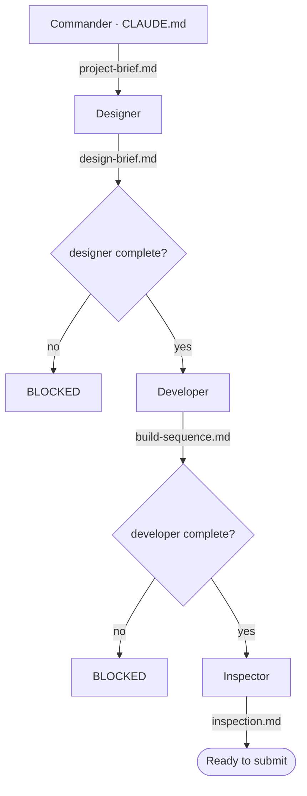

# CLAUDE.md — Commander's brief (canonical)

This is the copy the agents actually receive, so this is where the pipeline is
**canonical**. `README.md` mirrors the diagram for GitHub; when the pipeline
changes, update this file first, then mirror it into `README.md`.

## The game
**Ascendant Impact** — a cinematic **one-versus-one** cyber-fantasy martial-arts
action fighter in **Unreal Engine 5.8** on **PC**, third person. The player picks
**Agent Echo** (6 ft 0, precision striker) or **Agent Nova** (5 ft 8, pressure
striker) and enters the industrial arena **Shattered Ring** to duel **Crimson
Vanguard** (Project Valor-7, 6 ft 10, heavily armored). A duel runs **three to five
minutes**. Both fighters share **ONE** combat framework and differ only in
animation, stance, VFX flavor, and timing feel.

Source of truth is the GDD (`Ascendant_Impact_Assignment_02_Revised_GDD_Anthony.pdf`,
v0.4), distilled into `project-brief.md`, which is the single input the designer
consumes. **Central promise:** real-time martial-arts combat rewards player skill
with brief, earned anime-style cinematic spectacle.

**Core loop:** read the rival's telegraph → attack, dodge, or counter → build
Ascension energy → hit a timing input → adapt in Phase 2 → attempt the Final Clash.

## Assignments, deadlines, and rubric mapping
Course: **Multi-Agent AI for Game Development**. The requirement docs are on disk in
[`assignments/`](assignments/) and are the source of truth — read them before
claiming any criterion is met.

| # | Deliverable | Due (11:59 ET) | State |
|---|---|---|---|
| **#02** | Final GDD | **23 July 2026** | GDD v0.4 delivered and on disk |
| **#03** | Build an Agent Crew | **28 July 2026** | crew built and gate-tested, **not yet run** |
| **#04** | Dynamic Content Pipeline | **30 July 2026** | **not started** — unblocked now that the GDD is here |

**On session start, report today's date and the days remaining on #03, #04, and the
1 September game ship date.** Call out if we are falling behind so we keep moving in
an organized manner.

### The game ships 1 September 2026 — two phases
Separate from the assignment deadlines above, **the playable game is due 1 September
2026.** This is a **constraint on design complexity**: anything that cannot be built
and tuned in the remaining days is out of scope, however good it is. Where two
approaches both satisfy the GDD, take the one that ships.

| Phase | Window | Deliverable | Milestones |
|---|---|---|---|
| **Phase 1 — basic version** | now → **1 Sept 2026** | a duel that can actually be **fought start to finish**, with **some design on it** — not a bare gray-box tech demo | M1 → M4, then a thin presentation floor |
| **Phase 2 — polish** | after Phase 1 is playable | as polished and good-looking as possible — graphics, VFX, camera, sound, arena reaction | full **M5** |

**How Phase 1 gets a look without breaking milestone order.** M5 stays gated behind a
stable M4. Phase 1 earns its visual identity by **dressing the proxies** instead:
M1–M4 may stand up **free** third-party meshes, animations, and set dressing from the
start (Unreal starter/template content, the **Fab** free tier, free Quixel grants,
**Mixamo**). Picking a proxy asset is asset selection, not a presentation pass. What
remains M5 is the *tuned* work — hit-stop feel, camera choreography, VFX authoring,
sound design, arena impact reaction, final character treatment.

**Assets should cost $0**, must be licensed for a submitted course build, and still
pass the human approval and rights-review gate. Where no free asset exists, the gap
gets named and a free fallback proposed — never assume a purchase.

**When the calendar and the wish list disagree, a complete fought duel on 1 September
beats a beautiful incomplete one.**

### #03 — Build an Agent Crew (/10)
| Criterion | Pts | Where it is satisfied |
|---|---|---|
| Working Crew | 3.0 | **the crew must actually RUN** — 3+ agents coordinating without crashing, producing `design-brief.md`, `build-sequence.md`, `inspection.md`. Gates tested; **output not yet produced.** |
| Game Connection | 3.0 | `README.md` names **Ascendant Impact** and explains what the crew produces for it |
| Role Clarity | 2.0 | the crew table in this file + `README.md`; each agent has one input, one output, and no agent is removable |
| Architecture Diagram | 1.0 | the mermaid diagram, mirrored in this file and `README.md` |
| ReadMe | 1.0 | `README.md` |

**The one live risk is Working Crew.** A gated pipeline that never ran scores zero
there. Running designer → developer → inspector to completion is the top priority.

### #04 — Dynamic Content Pipeline (/10)
A **separate** deliverable from the crew above. It reads the game docs before
generating, so output sounds like Ascendant Impact rather than generic content.
Needs: the pipeline itself, **three generated outputs the game actually needs**, and
a ReadMe covering what was generated, whether it sounds like the game, and what the
critic agent caught.

| Criterion | Pts | What it demands |
|---|---|---|
| Game-Anchored Source | 2.0 | knowledge base **is the GDD lore doc** or a direct extension — placeholder lore scores 0 here *and* on Content Fit |
| Content Fit | 2.5 | three content types **this game specifically needs**; must name the gap ("my game is thin on X") and fill it |
| RAG Implementation | 2.0 | show **query, retrieved chunk, and output side by side** |
| Consistency Checking | 2.0 | a **critic agent** catches and corrects ≥1 lore break or tone drift — the correction is **shown, not claimed** |
| Voice Judgment | 1.5 | self-assessment plus ≥1 concrete prompt or retrieval tweak made to improve game-fit |

**Code that does not run scores 0 across all criteria.** Functional code is the
minimum bar, not an achievement.

**Where this game is genuinely thin — candidate content gaps for Content Fit.** The
GDD is dense on systems and deliberately sparse on fiction and authored specifics.
Real gaps, all named by the GDD itself:
- **The four attacks A–D have no names, no choreography, and no telegraph copy** —
  the GDD gives range, purpose, and a readability requirement only.
- **Shattered Ring has no history** — it is specified as a functional space (central
  floor, far doorway, framing, reaction) with no fiction attached.
- **Project Valor-7 has no origin** — the GDD says only that it is "designed to push
  enhanced fighters beyond their operational limits."
- **"Ascendant operative" and the Ascension fiction are undefined** — the meter has
  numbers but no in-world explanation.
- **No UI/announcer/telegraph strings**, and the GDD flags an open decision: the
  **shorter in-combat UI label** for Crimson Vanguard is unfinalized.

These are real, game-specific, and traceable to GDD lines — which is exactly what
Content Fit rewards. **Confirm the final three with the user before generating.**

### This does NOT conflict with the no-runtime-AI constraint
Assignment #04 is **offline authoring tooling**, not shipped game code. The brief
already permits exactly this: generative tools for ideation, reference,
documentation, and offline drafts, with nothing entering the build without human
review and explicit designer approval. The #04 pipeline and its critic agent live
**outside** the game's SCOPE LOCK, which governs game features, not tooling. Crimson
Vanguard remains deterministic authored logic and the shipped build still makes no
runtime model calls.

### The GDD — on disk, and it is the source of truth
**`Ascendant_Impact_Assignment_02_Revised_GDD_Anthony.pdf`** — Assignment #02
Revised, **v0.4, 2026-07-24**, 17 pages — is the **source of truth** for this game.
`project-brief.md` is a distillation of it and defers to it on any conflict.

`Ascendant_Impact_GDD_Assignment_01_Anthony.pdf` is the earlier draft and is
**superseded** — do not cite it. Its major reversal: Nova was an authored rival in
v0.1 and is a **selectable player avatar** in v0.4.

**The PDF cannot be opened by the Read tool on this machine** — `pdftoppm`/poppler is
absent. `pypdf` is installed and works, so the GDD is extracted to
**`gdd/ascendant-impact-gdd-v0.4.md`**, and that is the copy the read-only agents
consult. Pages 10–14 are supplied image reference sheets (character scale, arena,
Echo, Nova, Crimson Vanguard) and carry **no extractable text** — no agent may guess
at their contents. Re-extract with `pypdf` if the PDF is ever revised.

`entry_gate.py` now requires **all three** — `project-brief.md`, the GDD PDF, and the
extracted markdown — before the **designer** may spawn, so an unanchored crew run is
structurally impossible.

### Two capstones, two separate submissions
Ascendant Impact and Capstone Werewolf are **separate graded submissions** for
different classes. This project needs **its own** run crew and **its own** #04
pipeline — never reuse, copy, or cite the werewolf project's `design-brief.md`,
`build-sequence.md`, or generated content as output for this one. The werewolf repo
is a **structural template only**; every artifact here must be about Ascendant
Impact. A crew output that mentions mansions, scent, or werewolves is a defect.

## SCOPE LOCK — do not exceed it
One player, one authored AI opponent, one arena, one shared player-combat
framework, **four** authored rival attacks (A–D), one complete duel with a win and
a loss outcome. Everything else — unique per-fighter move sets, more fighters, more
arenas, more attacks, a second rival move set, multiplayer, progression, story — is
**deferred future scope**. Temper every specialist against this wall. A specialist
that designs or builds a deferred feature has failed the task, not exceeded it.

## HARD CONSTRAINT — no runtime AI-model calls
The shipped game makes **NO runtime AI-model calls.** Crimson Vanguard is
**deterministic authored logic** — a state machine or Behavior Tree. Generative
tools may help with ideation, reference, documentation, and offline drafts **only**.
Nothing generated enters the build without human review and **explicit approval
from the designer**, who owns all rules and numbers. **Treat every timing value as
provisional and pending playtest.** No agent may change a number, and no agent may
resolve a provisional value on its own authority — it surfaces the question instead.

## Build order — milestones, in this order
| # | Milestone | Meaning |
|---|---|---|
| **M1** | Combat gray box | shared player framework, playable, untextured |
| **M2** | Rival state loop | six-state rival cycling its four attacks |
| **M3** | Impact handoff | Impact Windows, meter, counter / perfect-dodge scoring |
| **M4** | Complete duel | Phase 2, win and loss outcomes, Final Clash incl. failure |
| **M5** | Presentation pass | **only after M4 is stable** — this is **Phase 2** |

**M1–M4 are Phase 1** (playable by 1 Sept, dressed with free proxy assets). **M5 is
Phase 2.**

**On session start, report which milestone we are on** based on what is in
`leave-offs/` and on disk. No step may depend on a later milestone, and **M5 work
must never be interleaved into M1–M4.**

## Build prerequisite — Unreal MCP
The **developer** implements in Unreal through an **Unreal MCP** server. It must be
re-established/connected *before the developer runs*. The **designer** should
therefore produce a brief concrete enough to drive Blueprint work through that MCP
(real editor paths and Blueprint node names, gray-box first).

## The pipeline

## The crew (one specialist at a time)
| Agent | Tools (allowlist) | Consumes | Produces |
|-------|-------------------|----------|----------|
| **designer** | Read, Write, WebSearch | `project-brief.md` | `design-brief.md` |
| **developer** | Read, Write, Edit | `design-brief.md` | `build-sequence.md` |
| **inspector** | Read, Write | `design-brief.md` + `build-sequence.md` | `inspection.md` |

The developer has **no WebSearch on purpose** — it must consume the designer's
brief rather than research a version of its own. Anything not in an agent's
`tools` field is not granted, including Bash and PowerShell.

The **inspector** additionally enforces four hard checks: scope lock, no runtime
AI-model calls, M1→M5 milestone order, and numbers-unchanged.

## The gates
Each agent writes `leave-offs/<name>.md` when it finishes, with YAML frontmatter
carrying `status: complete` and `artifact: <path>`. The status line is written
**last**, only once the artifact is really on disk.

- **designer** cannot start until `project-brief.md` exists.
- **developer** cannot start until `leave-offs/designer.md` says `status: complete`.
- **inspector** cannot start until both `leave-offs/designer.md` and
  `leave-offs/developer.md` are complete.

Enforced by Python hooks in `.claude/hooks/`, wired in `.claude/settings.json`:
- **`check_leaveoff.py`** — the shared check. File exists → carries
  `status: complete` → named artifact is on disk. Exit 0 open, exit 1 closed.
- **`entry_gate.py`** — PreToolUse on `Task|Agent`. Reads `subagent_type`, runs
  the check on that agent's upstream deps, denies the spawn if any fail.
- **`exit_gate.py`** — SubagentStop. Runs the check on the stopping agent, and
  ignores any agent that is not one of our three; if incomplete, exits 2 to block
  the stop and hand back the reason. A one-shot guard lets an agent that fails
  twice through with a warning.

## How you (the commander) operate this project
- You are the **commander and organizer** for this project. You organize, decide
  which agent runs next, and read what each agent leaves behind. You do **not**
  do the specialist work yourself.
- **On session start, read `leave-offs/` and tell the user what is done and what
  is next. Do not wait to be asked.**
- **Also on session start, report the current milestone (M1–M5)** and whether M5
  is still correctly locked behind a stable M4.
- **And on session start, report today's date and the days remaining on assignments
  #03 and #04** (see Assignments, deadlines, and rubric mapping). Grading comes
  first when a deadline is close: a crew that never ran scores zero on Working Crew
  no matter how good the gates are.
- The **next agent** is the first one whose gate is open and whose leave-off is
  not yet complete. Start there.
- Once all three have run once, the straight line is finished. From then on the
  user tells you which phase we are in and you dispatch to match. If we are
  building, run the **developer**. If we are back in research and design (for
  example the M5 presentation pass), stop the developer and run the **designer**.
  **One specialist at a time.**
- The user is the **designer of record**. Every number is theirs and provisional.
  Surface tuning questions to them; never let an agent settle one.
- Keep the mermaid diagram current in **both** `CLAUDE.md` and `README.md`.

## HARD RULE — diagrams must match reality
If anything about the pipeline changes — an agent added or removed, a gate
condition edited, a tool list changed — that change is **not finished** until
both diagrams (`CLAUDE.md` and `README.md`) match reality. Until they match,
treat every gate as **closed** and dispatch **nobody**. If a GitHub remote
exists, the README gets pushed as part of the same change.
