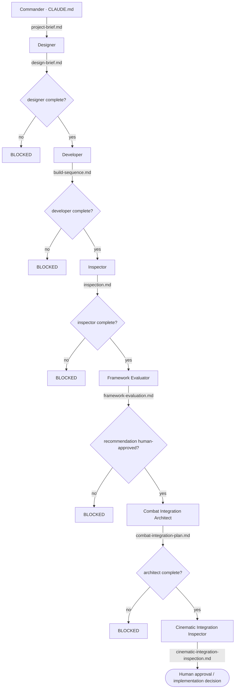

# Ascendant Impact — Cinematic 1v1 Cyber-Fantasy Action Fighter

**The game this crew is built for:** a PC / **Unreal Engine 5.8** third-person
action fighter. The player picks **Agent Echo** (6 ft 0, precision striker) or
**Agent Nova** (5 ft 8, pressure striker) and enters the industrial arena
**Shattered Ring** to duel **Crimson Vanguard** — Project Valor-7, 6 ft 10 and
heavily armored — for **three to five minutes**. The loop is: read the rival's
telegraph, answer with attack, dodge, or counter, build **Ascension** energy, hit a
timing input, adapt when **Phase 2** starts at 50 percent rival health, and attempt
the **Final Clash**, which unlocks only at meter 100 *and* rival health at or below
25 percent. Both fighters share **one** combat framework and differ only in
animation, stance, VFX flavor, and timing feel. The full design is in the GDD
(`Ascendant_Impact_Assignment_02_Revised_GDD_Anthony.pdf`, v0.4), distilled into
[`project-brief.md`](project-brief.md).

**Scope is locked:** one player, one authored AI opponent, one arena, one shared
combat framework, four authored rival attacks, one complete duel with a win and a
loss outcome. Everything else is deferred future scope.

**The rival is not an AI model.** Crimson Vanguard is deterministic authored Unreal
gameplay AI — a six-state machine or Behavior Tree (Idle / Reposition → Select
Attack → Telegraph → Active Attack → Recover → Return to Neutral). The shipped game
makes **no runtime AI-model calls**; generative tools serve ideation, reference, and
offline drafts only, and nothing enters the build without the designer's explicit
approval.

## What this crew produces

A gated, six-agent pipeline that turns the game's design into an actionable,
independently audited Unreal build plan for **this specific game**. A commander
organizes the work and dispatches one specialist at a time. The pipeline has two
halves: the original three-agent core crew, and Tony's three-agent specialist
extension that runs strictly after it.

### The original three-agent crew

- **Designer** — reads the project brief and researches how this game's systems
  (the shared combat framework, lock-on, perfect dodge and counter windows,
  Behavior Trees, anim montages and notify windows, data-driven attack definitions,
  Impact Windows, the Ascension Meter, Phase 2 re-timing, the Final Clash and its
  failure path) are built in Unreal 5.8 → produces `design-brief.md`.
- **Developer** — turns that brief into an ordered, buildable sequence of Unreal
  editor paths and Blueprint node names, grouped by milestone **M1 → M5** →
  produces `build-sequence.md`.
- **Inspector** — verifies every build step traces back to a decision in the design
  brief, and enforces four hard checks (scope lock, no runtime AI-model calls,
  milestone order with M5 last, and every number left unchanged) → produces
  `inspection.md`.

### Tony's three-agent specialist extension

Once the core crew has produced its three artifacts, a second gated chain takes
the approved plan from "what to build" to "how it lands in Unreal, and is it safe
to start." Each specialist consumes the previous agent's artifact and produces
exactly one of its own:

- **Framework Evaluator** — decides *what to build on*. Compares the approved
  Blueprint-first custom architecture against marketplace templates (n00dFighter /
  NFTiny, TRUE Fighting Game Engine), the C++ scaffold (marked not evaluable — no
  source files supplied), and a minimal hybrid, scoring all candidates on a
  20-criterion matrix with an evidence ledger that separates verified facts from
  seller claims → produces `framework-evaluation.md`.
- **Combat Integration Architect** — decides *how every system lands on the
  chosen foundation*. Runs only after the human designer's recorded approval of
  the recommendation, then maps all 28 required duel systems — the shared
  Echo/Nova fighter, the six-state Crimson Vanguard loop, the four data-driven
  attacks, Impact Windows, and the recoverable Final Clash — onto the approved
  foundation with per-system acceptance conditions, risks, milestone contracts,
  and a vertical-slice proof → produces `combat-integration-plan.md`.
- **Cinematic Integration Inspector** — independently verifies *that the result
  is still Ascendant Impact*. Audits both upstream artifacts against ten hard
  checks drawn from the GDD (scope lock, no runtime AI, numbers unchanged,
  milestone order, cinematic handoff safety, and more) and reports violations and
  required corrections rather than silently fixing them → produces
  `cinematic-integration-inspection.md`.

The chain ends at a **human approval / implementation decision**: the designer of
record accepts or amends the corrections before implementation proceeds.

### Why no agent can be removed

Python gate hooks hard-gate the original three-agent crew — the designer,
developer, and inspector cannot start until their upstream leave-offs are
genuinely complete. The specialist extension is not registered in those hooks;
it enforces the same ordering through its own dependency contracts: each
specialist's definition names its required input artifacts, writes an explicit
`BLOCKED` result if one is missing, checks upstream artifact existence before
producing anything, and — for the combat integration architect — requires the
recorded human-approval decision before it may begin. Either way, every artifact
is guaranteed to line up with the ones before it and with the game. Removing any
one agent breaks the dependency chain: without the
designer there is no brief for the developer; without the developer there is
nothing for the inspector to verify; without the inspector's clean verdict the
framework evaluator is blocked; without the evaluator there is no recommendation
for the human to approve or for the architect to map; without the architect there
is no plan for the cinematic integration inspector to audit; and without that
final inspector, real specification gaps in the cinematic handoff would have
reached implementation unchallenged.

**All six agents have now run successfully in order, each completing its
required dependency checks**:
`design-brief.md` → `build-sequence.md` → `inspection.md` →
`framework-evaluation.md` → `combat-integration-plan.md` →
`cinematic-integration-inspection.md`, with every handoff recorded in
[`leave-offs/`](leave-offs/). The final verdict is **APPROVED WITH REQUIRED
CHANGES** — the sandbox test and milestones M1–M2 may proceed on the approved
Blueprint-first foundation, while M3 sign-off waits on the designer's acceptance
of five named corrections to the cinematic restore contract.

## Build order

**M1** combat gray box → **M2** rival state loop → **M3** Impact handoff →
**M4** complete duel → **M5** presentation pass. M5 only after M4 is stable.

The game ships in two phases. **Phase 1 (due 1 September 2026)** is M1–M4: a duel
that can be fought start to finish, dressed with free proxy assets so it reads as a
game rather than a gray-box demo. **Phase 2** is M5, the polish pass.

## Pipeline

The canonical copy of this pipeline lives in [`CLAUDE.md`](CLAUDE.md); this diagram
is a mirror. If the pipeline changes, `CLAUDE.md` is updated first and this file is
kept in sync.

## Where the deliverables live

| Deliverable | File |
|---|---|
| Crew code — six coordinating agents | [`.claude/agents/`](.claude/agents/) (`designer`, `developer`, `inspector`, `framework-evaluator`, `combat-integration-architect`, `cinematic-integration-inspector`) |
| Orchestration and gating | Hard Python hooks for the original three-agent crew: [`.claude/hooks/`](.claude/hooks/), wired in [`.claude/settings.json`](.claude/settings.json). Tony's specialist extension is ordered by self-blocking dependency contracts in each agent definition (required inputs, explicit `BLOCKED` behavior, artifact-existence checks, recorded human approval) rather than by the hooks. |
| Mermaid diagram — roles, connections, data flow | this file and [`CLAUDE.md`](CLAUDE.md) |
| ReadMe — what the crew produces and for which game | this file |
| Crew output | `design-brief.md` → `build-sequence.md` → `inspection.md` → `framework-evaluation.md` → `combat-integration-plan.md` → `cinematic-integration-inspection.md`, with handoffs recorded in [`leave-offs/`](leave-offs/) |

The game is **Ascendant Impact**. Course requirement docs are in
[`assignments/`](assignments/).
