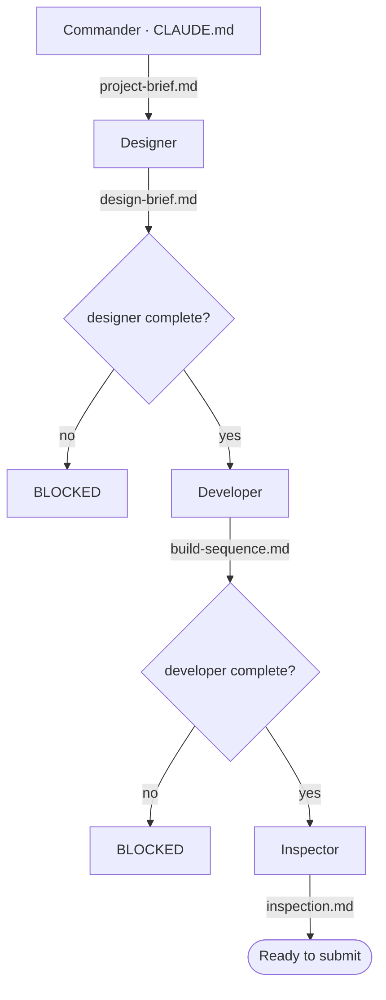

# Ascendant Impact — Cinematic 1v1 Cyber-Fantasy Action Fighter

**The game this crew is built for:** a PC / **Unreal Engine 5.8** third-person
action fighter. The player picks **Agent Echo** (6 ft 0, precision striker) or
**Agent Nova** (5 ft 8, pressure striker) and enters the industrial arena
**Shattered Ring** to duel **Crimson Vanguard** — Project Valor-7, 6 ft 10 and
heavily armored — for **three to five minutes**. The loop is: read the rival's
telegraph, answer with attack, dodge, or counter, build **Ascension** energy, hit a
timing input, adapt when **Phase 2** starts at 50 percent rival health, and attempt
the **Final Clash**, which unlocks only at meter 100 *and* rival health at or below
25 percent. Both fighters share **one** combat framework and differ only in
animation, stance, VFX flavor, and timing feel. The full design is in the GDD
(`Ascendant_Impact_Assignment_02_Revised_GDD_Anthony.pdf`, v0.4), distilled into
[`project-brief.md`](project-brief.md).

**Scope is locked:** one player, one authored AI opponent, one arena, one shared
combat framework, four authored rival attacks, one complete duel with a win and a
loss outcome. Everything else is deferred future scope.

**The rival is not an AI model.** Crimson Vanguard is deterministic authored Unreal
gameplay AI — a six-state machine or Behavior Tree (Idle / Reposition → Select
Attack → Telegraph → Active Attack → Recover → Return to Neutral). The shipped game
makes **no runtime AI-model calls**; generative tools serve ideation, reference, and
offline drafts only, and nothing enters the build without the designer's explicit
approval.

## What this crew produces

A gated, three-agent pipeline that turns the game's design into an actionable
Unreal build plan for **this specific game**. A commander organizes the work and
dispatches one specialist at a time:

- **Designer** — reads the project brief and researches how this game's systems
  (the shared combat framework, lock-on, perfect dodge and counter windows,
  Behavior Trees, anim montages and notify windows, data-driven attack definitions,
  Impact Windows, the Ascension Meter, Phase 2 re-timing, the Final Clash and its
  failure path) are built in Unreal 5.8 → produces `design-brief.md`.
- **Developer** — turns that brief into an ordered, buildable sequence of Unreal
  editor paths and Blueprint node names, grouped by milestone **M1 → M5** →
  produces `build-sequence.md`.
- **Inspector** — verifies every build step traces back to a decision in the design
  brief, and enforces four hard checks (scope lock, no runtime AI-model calls,
  milestone order with M5 last, and every number left unchanged) → produces
  `inspection.md`.

Python gate hooks keep each agent from starting until its inputs are genuinely
complete, so the design brief, build sequence, and inspection report are guaranteed
to line up with each other and with the game. No agent can be removed without
breaking the pipeline.

## Build order

**M1** combat gray box → **M2** rival state loop → **M3** Impact handoff →
**M4** complete duel → **M5** presentation pass. M5 only after M4 is stable.

The game ships in two phases. **Phase 1 (due 1 September 2026)** is M1–M4: a duel
that can be fought start to finish, dressed with free proxy assets so it reads as a
game rather than a gray-box demo. **Phase 2** is M5, the polish pass.

## Pipeline

The canonical copy of this pipeline lives in [`CLAUDE.md`](CLAUDE.md); this diagram
is a mirror. If the pipeline changes, `CLAUDE.md` is updated first and this file is
kept in sync.

## Where the deliverables live

| Deliverable | File |
|---|---|
| Crew code — three coordinating agents | [`.claude/agents/`](.claude/agents/) (`designer`, `developer`, `inspector`) |
| Orchestration and gating | [`.claude/hooks/`](.claude/hooks/), wired in [`.claude/settings.json`](.claude/settings.json) |
| Mermaid diagram — roles, connections, data flow | this file and [`CLAUDE.md`](CLAUDE.md) |
| ReadMe — what the crew produces and for which game | this file |
| Crew output | `design-brief.md` → `build-sequence.md` → `inspection.md`, with handoffs recorded in [`leave-offs/`](leave-offs/) |

The game is **Ascendant Impact**. Course requirement docs are in
[`assignments/`](assignments/).
